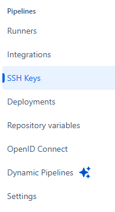
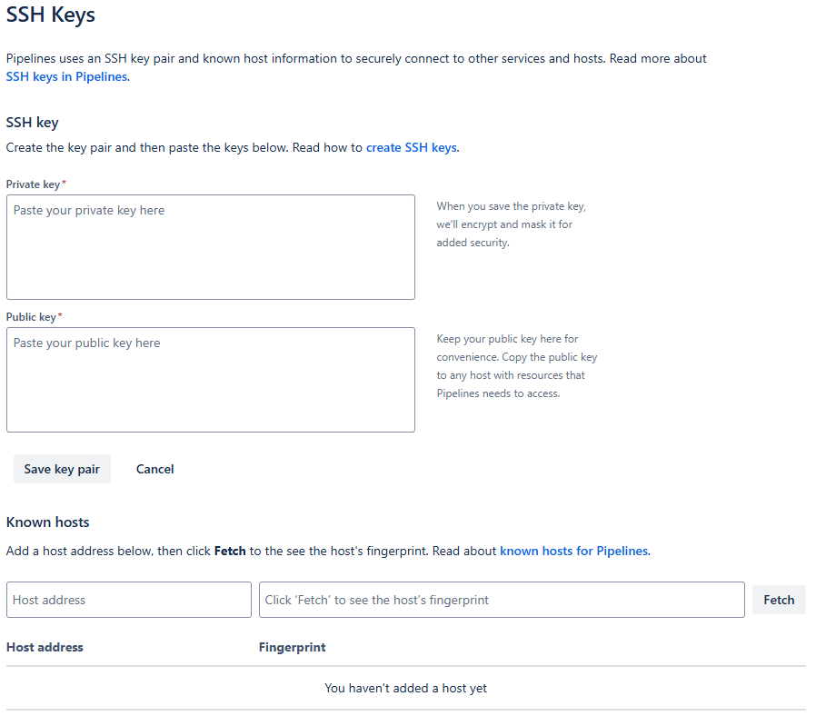
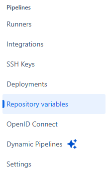
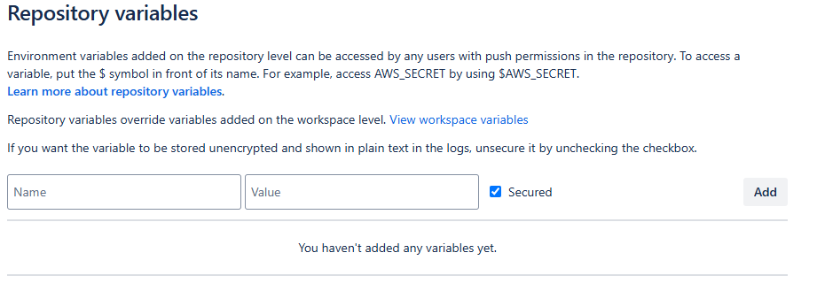

# Setup Pipeline

## Create bitbucket-pipelines.yml

Create `bitbucket-pipelines.yml` in the root of the project.

Add rules like below

```yml
image: atlassian/default-image:latest

pipelines:
  branches:
    staging:
      - step:
          name: 'Deploy to Staging Server'
          deployment: staging
          script:
            - ssh -o StrictHostKeyChecking=no "$STG_SERVER_USER@$STG_SERVER_IP"
            - cd $STG_APP_PATH
            - git pull
            - docker-compose up -d --build
```

## Add SSH key to the repository settings

You can open `SSH Keys`



Then enter private/public keys in the sections



## Add variables to the repository settings

You can open `Repository variables`



Then enter private/public keys in the sections


